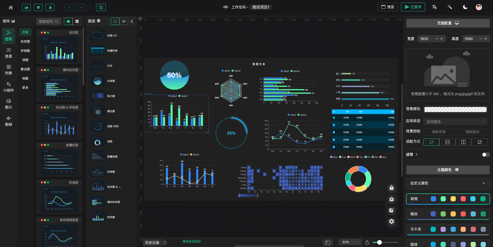

# Django + GoView

An Django extension for Django and GoView



## 引导

演示地址: [https://demo.mtruning.club/](https://demo.mtruning.club/)


## Install & Usage

* Install :
  ```pip install django-go-view```
* Optimize the proj setting.py:

```python
INSTALLED_APPS = [
    '......',
    'django.contrib.admin',
    'django.contrib.auth',
    'django.contrib.contenttypes',
    'django.contrib.sessions',
    'django.contrib.messages',
    'django.contrib.staticfiles',
    'goview',
    '.......',
]
```

* Add the urls

```python
from django.urls import path, include, re_path

urlpatterns = [
    ...
]

urlpatterns += [
    ...
    re_path(r'^goview/', include('goview.urls', namespace='photologue')),
]
```

* Sync Your Database

```shell
python manage.py migrate goview
```

## Contribute & Development

* Admin 页面账号和密码统一都是: `go-view` / `go-view`.

### 发布

#### Generating distribution archives

* Now run this command from the same directory where pyproject.toml is located:
  ```shell
  python setup.py sdist bdist_wheel
  ```
  This command should output a lot of text and once completed should generate two files in the dist directory:
  ```shell
  dist/
  ├── example_package_YOUR_USERNAME_HERE-0.0.1-py3-none-any.whl
  └── example_package_YOUR_USERNAME_HERE-0.0.1.tar.gz
  ```

#### Uploading the distribution archives

* Now that you are registered, you can use twine to upload the distribution packages. You’ll need to install Twine:
  ```shell
  python3 -m pip install --upgrade twine
  ```
* Once installed, run Twine to upload all of the archives under dist:
  ```shell
  python3 -m twine upload --repository testpypi dist/*
  ```

## 友情链接

* [API文档](https://docs.apipost.cn/preview/5aa85d10a59d66ce/ddb813732007ad2b?target_id=dd81da11-9f8c-48ce-a4e8-3647279683fe)
* 前端源代码: [github]() / [gitee](https://gitee.com/dromara/go-view)
* [后端Java版](https://gitee.com/MTrun/go-view-serve)
